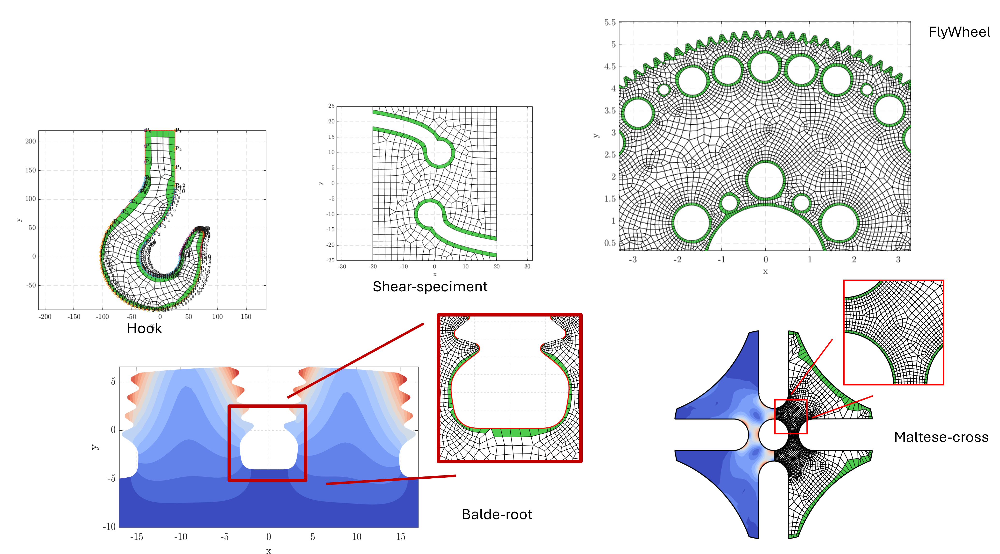

# NEFEM on Quadrilateral Meshes



**NURBS-enhanced finite element method (NEFEM) on quadrilateral meshes**  
**M. Montanari, G.M. Santi, R. Sevilla, A. Liverani, N. Petrinic**  
*Finite Elements in Analysis and Design*, Vol. 231, 2024, 104099.  

📄 **Full paper on ScienceDirect:**  
[https://www.sciencedirect.com/science/article/pii/S0168874X23001920](https://www.sciencedirect.com/science/article/pii/S0168874X23001920)

---

## Overview

This project presents a quadrilateral formulation of the **NURBS-enhanced Finite Element Method (NEFEM)** that integrates exact CAD boundary representations (B-rep) into a standard FEM workflow. The method improves geometric fidelity at the boundary with negligible computational overhead and demonstrates accuracy gains on heat transfer and linear elasticity benchmarks, as well as complex CAD geometries.

---

## Highlights

- **Quadrilateral NEFEM elements**: extending NEFEM beyond triangles/tetrahedra.  
- **Exact CAD boundary conformance** via NURBS B-rep on boundary-adjacent elements.  
- **Demonstrated accuracy improvements** on canonical problems and real CAD parts.  

Following this publication, the work was further presented at **ECCOMAS 2024** in the conference contribution:  
*“Leveraging Quadrilateral Meshes in NEFEM for Enhanced CAD-to-Analysis Integration”*,  
with emphasis on **p = 2 implementations**.

---

## Repository Status

> **Source code is not publicly available in this repository.**  
> For access inquiries or collaborations, please contact **gianmaria.santi2@gmail.com**.


---

## How to Cite

If you use ideas or results from this work, please cite:

```bibtex
@article{Montanari2024NEFEM,
  title   = {NURBS-enhanced finite element method (NEFEM) on quadrilateral meshes},
  author  = {Montanari, M. and Santi, G.~M. and Sevilla, R. and Liverani, A. and Petrinic, N.},
  journal = {Finite Elements in Analysis and Design},
  volume  = {231},
  pages   = {104099},
  year    = {2024},
  doi     = {10.1016/j.finel.2023.104099}
}
```
